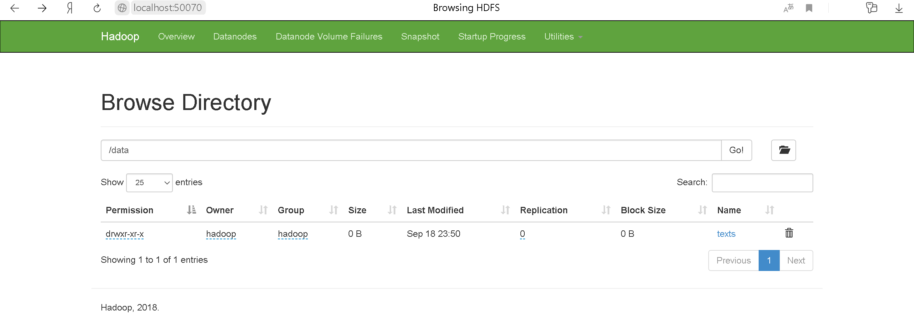

## beginner  

 1) ssh -i emr.pem -N -L 50070:ec2-3-249-21-2.eu-west-1.compute.amazonaws.com:50070 hadoop@ec2-3-249-21-2.eu-west-1.compute.amazonaws.com
 2) http://localhost:50070/explorer.html#/data  

    ответ: 1 папка texts  

## Intermediate
ssh -i emr.pem hadoop@ec2-3-249-21-2.eu-west-1.compute.amazonaws.com

* -ls  

hdfs dfs -help ls

 1. hdfs dfs -ls -C /data/texts/  

    /data/texts/twain.txt  

 2. hdfs dfs -ls -h /data/texts/ 

    Found 1 items  
    -rw-r--r--   1 hadoop hadoop        714 2020-09-18 20:50 /data/texts/twain.txt  

 3. actual  

* -du  
