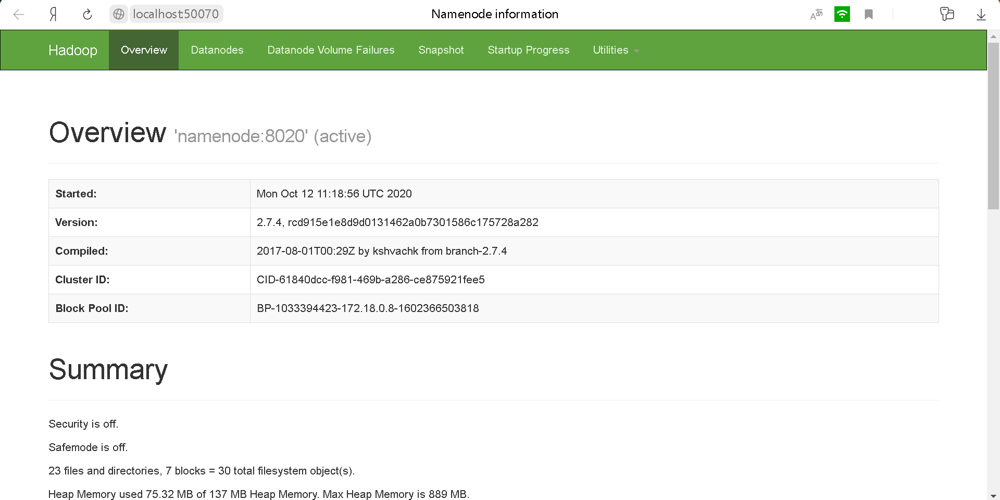
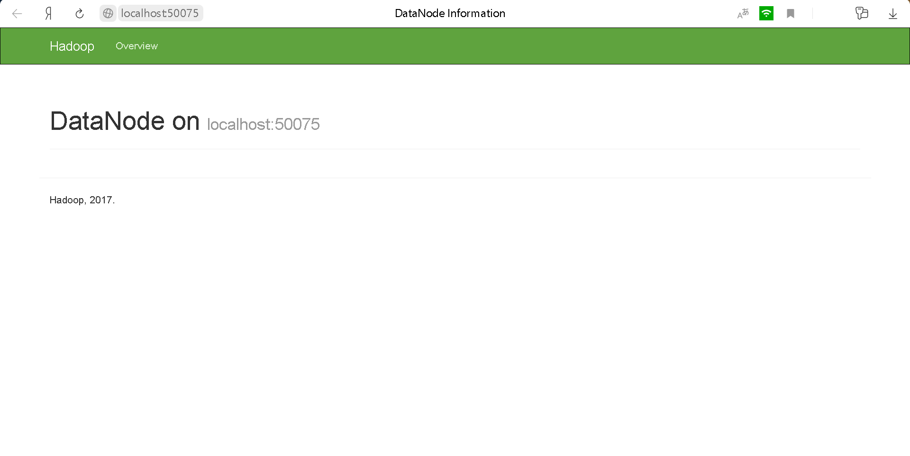

# Hadoop local

Для данной задачи мы научимся разворачивать собственную экосистему Hadoop и повторим основные этапы из нашего занятия, посвященного теме локальной разработки кластера.  

В ходе выполнения, вы не ограничены вариантом решения и можете использовать любой из подходов, перечисленных на слайде ”Варианты реализации”.  

В качестве решения, предлагается выслать скриншоты работающего HDFS WebUI на namenode на localhost, а также описание системы, которую вы развернули.  

### Варианты решения:
1. Локальная установка и разворачивание Hadoop для вашей конкретной операционной системы
2. Использование Docker для запуска Hadoop (например - https://github.com/big-data-europe/docker-hadoop)
3. Установка Hadoop на кластер AWS EMR (рекомендуется использовать emr 5.30.1 релиз)

### Использование Docker для развертывания Hadoop

Для запуска экосистемы Hadoop локально был выбран вариант с использованием Docker, как самый оптимальный. Использован следующий [репозиторий](https://github.com/tech4242/docker-hadoop-hive-parquet). Развернутый docker-container представляет собой **Hadoop cluster** с **Hive**, предназначенный для SQL запросов к файлам вида parquet.  

### NameNode

### DataNode

